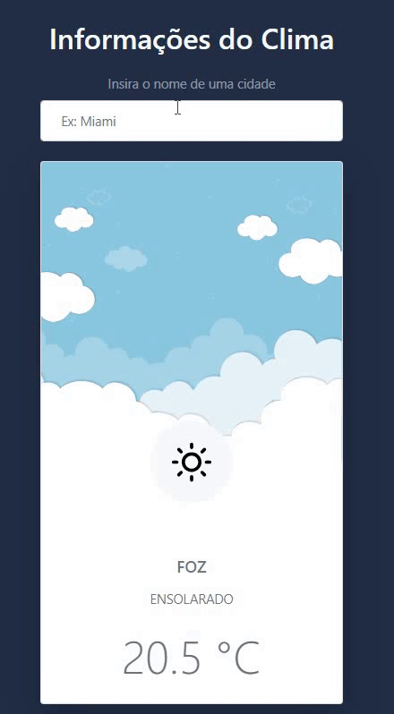

<h1 align="center">Weather App</h1>

  <a href="#-aplicação">Aplicação</a>  | 
  <a href="#-tecnologias">Tecnologias</a>   |   
  <a href="#-page">Page</a>   
  

     

 

## ⛈️ Aplicação

> O Weather App é uma aplicação Web que permite buscar informações meteorológicas atualizadas de uma cidade por meio da Accu Weather API. 
 

## 🚀 Tecnologias

- **HTML**

- **CSS**

- **Bootstrap**

- **JavaScript**
  
   

## 🔖 Page

- Você pode visualizar o resultado final do projeto através [desse link](https://angelicacamp.github.io/weather-app/).

 
---

Feito com ♥ by Angélica C.
